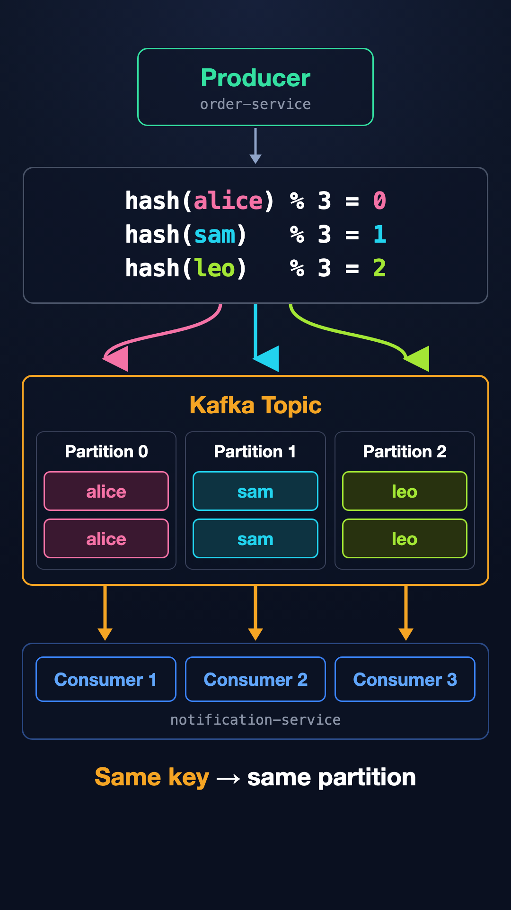

# Kafka Partitioning — explained with pizza orders

A tiny, runnable demo of **how Kafka splits one topic into partitions, which message goes where, and why it matters**.

Three customers order food at the same time. Every customer's orders stay in order. Three consumers share the work. Stop one — the others take over in about 2 seconds.

> 📱 This repo is the code behind an Instagram reel. Clone it, run one command, and watch partitioning happen live.
>
> New to Kafka? Three words are enough to start: a **topic** is a named stream of messages, a **producer** writes to it, a **consumer** reads from it.

---

## The idea in one picture

<p align="center">
  
</p>

> The image is **1080 × 1920 (9:16)** — Instagram reel size.

The same picture, as text:

```
                    POST /api/order   { "customerId": "alice", ... }
                                    │
                                    ▼
                         ┌─────────────────────┐
                         │    order-service    │   key = customerId
                         │      PRODUCER       │   partition = murmur2(key) % 3
                         └──────────┬──────────┘
              ┌─────────────────────┼─────────────────────┐
              ▼                     ▼                     ▼
     ┌─────────────────┐   ┌─────────────────┐   ┌─────────────────┐
     │   partition 0   │   │   partition 1   │   │   partition 2   │   topic "orders"
     │  alice · maria  │   │       sam       │   │       leo       │
     └────────┬────────┘   └────────┬────────┘   └────────┬────────┘
              ▼                     ▼                     ▼
         consumer A            consumer B            consumer C       group "notification-service"
```

The topic `orders` is split into **3 partitions**. Everything in this README follows from that one number.

---

## Why partitions exist

A partition is the unit of parallelism in Kafka. **Inside a consumer group, one partition is read by exactly one consumer.**

So with 1 partition, adding a second notification-service does nothing — it sits idle. Your whole topic is capped at the speed of one consumer.

Split the topic into 3 partitions and 3 consumers can work at once, each on its own slice.

But that creates a new problem: **if messages are spread across partitions, what happens to their order?**

---

## The one rule

Every message can carry a **key**. Kafka's default partitioner turns the key into a partition number:

```
partition = (murmur2(keyBytes) & 0x7fffffff) % numberOfPartitions
```

Don't worry about `murmur2` — it's just a hash, a function that turns text into a big number. What matters:

| Because… | …it follows that |
| --- | --- |
| It's a pure function of the key | **Same key → same partition. Always.** |
| A partition is an append-only log | **Messages in one partition stay in the order they were written.** |
| Put those together | **All of alice's orders are in one partition, in order.** |
| Different keys hash independently | Different customers spread across partitions → parallel work. |
| No key → nothing to hash | The message goes to any partition → **no ordering guarantee.** |

You can watch the maths for any key:

```bash
curl localhost:3000/api/where/alice
```
```json
{
  "key": "alice",
  "keyBytes": "97 108 105 99 101",
  "murmur2": "0x74504595",
  "afterSignBitCleared": 1951417749,
  "partitionCount": 3,
  "partition": 0,
  "formula": "(0x74504595 & 0x7fffffff) % 3 = 0"
}
```

`1951417749 ÷ 3` leaves remainder `0`. Alice goes to partition 0. Today, tomorrow, on every machine.

---

## How partitioning works — step by step

Follow the picture from top to bottom.

**1. The topic is created with a fixed number of partitions.**
`docker-compose.yml` runs `kafka-topics.sh --create --topic orders --partitions 3`. From now on `orders` is really three separate logs: partition 0, 1 and 2. Kafka stores and serves each one independently.

**2. The producer attaches a key to every message.**
`order-service` sends each order with `key: customerId`. The key isn't a filter or an address. It's a label that says "these messages belong together".

**3. The producer client — not the broker — picks the partition.**
Before the message leaves the app, the Kafka client computes `murmur2("alice") % 3 = 0`. The broker receives the message already addressed to partition 0 and doesn't second-guess it.

**4. The partition appends it at the next offset.**
Each partition is an append-only log with its own counter. alice's orders get offsets 0, 1 and 3 in partition 0. maria's order sits between them at offset 2. Nothing is ever inserted in the middle or reordered.

**5. The consumer group splits the partitions.**
The three `notification-service` containers share one `groupId`. Kafka assigns every partition to **exactly one** of them. consumer-1 reads partition 0 from offset 0 upward, in order. It never sees partition 1 or 2.

**6. Put together:** alice → always partition 0 → always the same consumer → always in the order she placed them. Meanwhile sam and leo are processed in parallel, by other consumers.

### What partitioning does *not* promise

| Myth | Reality |
| --- | --- |
| "The topic is ordered" | Only each **partition** is ordered. Partition 0 and partition 1 have no order relative to each other. |
| "Each customer gets their own partition" | Keys share partitions. alice and maria are both on partition 0. |
| "Load is automatically even" | Only if the keys are. One huge customer means one busy partition. |
| "I can add partitions later for free" | Adding partitions changes `% N`, so keys move. See Demo 4. |

---

## Kafka vocabulary for this reel

| Term | Plain English | In this repo |
| --- | --- | --- |
| **Partition** | One of the numbered logs a topic is split into. | `orders` has partitions 0, 1, 2 |
| **Key** | The label on a message that decides its partition. | `customerId` |
| **Offset** | A message's position **inside its partition**. Every partition counts from 0 on its own. | `partition 1 · offset 2` |
| **Consumer group** | Consumers with the same `groupId`. They split partitions between them instead of each reading everything. | `notification-service` |
| **Rebalance** | The group reshuffling who owns which partition, when a consumer joins or leaves. | Watch it when you stop a container |

---

## Run it

**Requirement:** Docker.

```bash
git clone https://github.com/SidVermaS/Kafka-Partitioning.git
cd Kafka-Partitioning
docker compose up --build
```

That starts Kafka, creates `orders` with 3 partitions, the producer, **three** consumers, and a Kafka UI at [localhost:8080](http://localhost:8080).

| Container | Its job in the partitioning story |
| --- | --- |
| `kafka` | The broker. Stores each partition as its own log. Auto topic creation is **off**. |
| `create-topic` | Creates `orders` with `--partitions 3`, prints the layout, exits. |
| `order-service` | Producer. Keys every order by `customerId`. |
| `notification-1/2/3` | Three consumers in **one** group — Kafka gives each a partition. |
| `verifier` | Not started by `up`. Proves the claims in this README. |
| `kafka-ui` | Browse messages per partition. |

See how the topic was laid out:

```bash
docker compose logs create-topic
```
```
Created topic orders.
Topic: orders	PartitionCount: 3	ReplicationFactor: 1	Configs: min.insync.replicas=1
	Topic: orders	Partition: 0	Leader: 1	Replicas: 1	Isr: 1
	Topic: orders	Partition: 1	Leader: 1	Replicas: 1	Isr: 1
	Topic: orders	Partition: 2	Leader: 1	Replicas: 1	Isr: 1
```

Three partitions, all led by broker `1`, since this demo runs a single broker. (Output trimmed of the topic ID and empty columns.) In production each partition would also have replicas on other brokers — that's *replication*, a separate topic from partitioning.

In a second terminal, follow the consumers:

```bash
docker compose logs -f notification-1 notification-2 notification-3
```

Each one announces the partition it was given:

```
🎧 consumer-1 now owns partition(s): p2
🎧 consumer-2 now owns partition(s): p1
🎧 consumer-3 now owns partition(s): p0
```

(Which consumer gets which partition can differ between runs. That each gets exactly one does not.)

---

## Demo 1 — orders WITH a key

Send 9 orders from 4 customers, keyed by `customerId`:

```bash
curl -XPOST localhost:3000/api/demo
```

The response is built from the **broker's own acknowledgements** — nothing here is predicted:

```
┌──────────────────────────────────────────────────────────────────────┐
│ topic "orders"  ·  3 partitions  ·  9 messages                       │
│                                                                      │
│ partition 0  ▓▓▓▓░░░░░░  4 msg                                       │
│    offset 0   alice #1       Margherita Pizza                        │
│    offset 1   alice #2       Garlic Bread                            │
│    offset 2   maria #1       Cheeseburger                            │
│    offset 3   alice #3       Tiramisu                                │
│                                                                      │
│ partition 1  ▓▓▓░░░░░░░  3 msg                                       │
│    offset 0   sam #1         Sushi Platter                           │
│    offset 1   sam #2         Miso Ramen                              │
│    offset 2   sam #3         Green Tea                               │
│                                                                      │
│ partition 2  ▓▓░░░░░░░░  2 msg                                       │
│    offset 0   leo #1         Beef Tacos                              │
│    offset 1   leo #2         Spring Rolls                            │
│                                                                      │
├──────────────────────────────────────────────────────────────────────┤
│ Per-customer ordering                                                │
│                                                                      │
│   ✅ alice     3 orders  all on partition 0 — order kept             │
│   ✅ sam       3 orders  all on partition 1 — order kept             │
│   ✅ leo       2 orders  all on partition 2 — order kept             │
│   ✅ maria     1 order   all on partition 0 — order kept             │
│                                                                      │
│   ✅ partitioner.js predicted 9/9 partitions correctly               │
└──────────────────────────────────────────────────────────────────────┘

```

Three things to point at:

1. **alice's 3 orders all sit in partition 0**, at ascending offsets. Pizza → Garlic Bread → Tiramisu, the order she placed them.
2. **maria also landed in partition 0.** Partitions are shared buckets, not one-per-customer. That's fine — her orders are still in order, and so are alice's.
3. **The consumer logs line up** — each consumer only ever sees its own partition:

```
p0 offset 0   consumer-3  key=alice      → alice #1 Margherita Pizza
p0 offset 1   consumer-3  key=alice      → alice #2 Garlic Bread
p0 offset 2   consumer-3  key=maria      → maria #1 Cheeseburger
p0 offset 3   consumer-3  key=alice      → alice #3 Tiramisu
p1 offset 0   consumer-2  key=sam      → sam #1 Sushi Platter
p1 offset 1   consumer-2  key=sam      → sam #2 Miso Ramen
p1 offset 2   consumer-2  key=sam      → sam #3 Green Tea
p2 offset 0   consumer-1  key=leo       → leo #1 Beef Tacos
p2 offset 1   consumer-1  key=leo       → leo #2 Spring Rolls
```

---

## Demo 2 — the same orders WITHOUT a key

Reset, then send the exact same 9 orders with `key: null`:

```bash
curl -XDELETE localhost:3000/api/demo
curl -XPOST "localhost:3000/api/demo?keyed=false"
```

```
┌──────────────────────────────────────────────────────────────────────┐
│ topic "orders"  ·  3 partitions  ·  9 messages                       │
│                                                                      │
│ partition 0  ▓▓▓▓░░░░░░  4 msg                                       │
│    offset 4   <no key>       Margherita Pizza                        │
│    offset 5   <no key>       Sushi Platter                           │
│    offset 6   <no key>       Tiramisu                                │
│    offset 7   <no key>       Spring Rolls                            │
│                                                                      │
│ partition 1  ▓░░░░░░░░░  1 msg                                       │
│    offset 3   <no key>       Green Tea                               │
│                                                                      │
│ partition 2  ▓▓▓▓░░░░░░  4 msg                                       │
│    offset 2   <no key>       Beef Tacos                              │
│    offset 3   <no key>       Garlic Bread                            │
│    offset 4   <no key>       Cheeseburger                            │
│    offset 5   <no key>       Miso Ramen                              │
│                                                                      │
├──────────────────────────────────────────────────────────────────────┤
│ Per-customer ordering                                                │
│                                                                      │
│   ❌ alice     3 orders  split across p0, p2 — ORDER LOST            │
│   ❌ sam       3 orders  split across p0, p1, p2 — ORDER LOST        │
│   ❌ leo       2 orders  split across p0, p2 — ORDER LOST            │
│   ⚠️ maria     1 order   on p2 by luck — no key, no guarantee        │
└──────────────────────────────────────────────────────────────────────┘

```

Now alice's Garlic Bread can be processed **before** her Pizza — they sit in different partitions, read by different consumers. If those were `PAYMENT_CAPTURED` and `ORDER_CANCELLED`, you just refunded an order that was never charged.

Without a key the partition is picked at random, so your table will look different — run it twice and compare. A ⚠️ means orders happened to land together **by luck**, not by guarantee.

> Offsets don't restart at 0 after the reset. That's correct: Kafka never reuses an offset, even after records are deleted.

---

## Demo 3 — consumers sharing (and taking over) the work

**Stop one consumer:**

```bash
docker compose stop notification-3
```

```
👋 consumer-3 leaving the group…
↩️  consumer-3 gave up partition(s): p0
↩️  consumer-1 gave up partition(s): p1
🎧 consumer-1 now owns partition(s): p0 p2
🎧 consumer-2 now owns partition(s): p1
```

(Consumer and partition numbers vary from run to run.) Measured on this repo: consumer-3 left at `:56.85`, its partition had a new owner at `:59.01` — **about 2 seconds**. No orders lost; new orders for that partition are picked up by the survivors.

That speed comes from the consumer calling `disconnect()` on shutdown, which tells the group it's leaving. Without that, Kafka only notices after `session.timeout.ms` (45 s by default) — the partition just sits unread in the meantime.

**Bring it back:**

```bash
docker compose start notification-3
```

The group rebalances again and it's back to one partition each.

**Now try adding a 4th consumer to a 3-partition topic:**

```bash
docker compose run -d --no-deps --name consumer-4 -e CONSUMER_NAME=consumer-4 notification-1
docker compose logs notification-1 notification-2 notification-3 | grep owns ; docker logs consumer-4
```

```
🎧 consumer-4 now owns partition(s): p0
🎧 consumer-1 now owns partition(s): (none)
```

Somebody gets **nothing**. More consumers than partitions is wasted money. **Your partition count is the ceiling on how parallel a consumer group can ever be.**

```bash
docker rm -f consumer-4     # clean up
```

---

## Demo 4 — change the partition count

The partition count is one setting, `PARTITIONS`, used by both `create-topic` and `order-service`. Recreate everything with 6:

```bash
docker compose down
PARTITIONS=6 docker compose up --build
```

(`down` is required. A topic's partition count is set when it's created, and this demo keeps Kafka's data inside the container.)

**The consumers now own two partitions each:**

```
🎧 consumer-1 now owns partition(s): p1 p4
🎧 consumer-2 now owns partition(s): p2 p5
🎧 consumer-3 now owns partition(s): p0 p3
```

**And every customer moved:**

```bash
curl localhost:3000/api/where/alice
```
```json
{ "murmur2": "0x74504595", "partitionCount": 6, "partition": 3,
  "formula": "(0x74504595 & 0x7fffffff) % 6 = 3" }
```

Same key, same hash — but `% 6` instead of `% 3`, so alice goes to **partition 3** instead of 0. Run the demo:

```
│   ✅ alice     3 orders  all on partition 3 — order kept             │
│   ✅ sam       3 orders  all on partition 4 — order kept             │
│   ✅ leo       2 orders  all on partition 2 — order kept             │
│   ✅ maria     1 order   all on partition 3 — order kept             │
│                                                                      │
│   ✅ partitioner.js predicted 9/9 partitions correctly               │
```

Two lessons in that table:

1. **Almost every key moved.** alice went 0 → 3, sam 1 → 4, maria 0 → 3. leo happened to land on 2 again, pure coincidence of the arithmetic, and not something you can plan around. On a fresh topic that's harmless. On a live topic, alice's old orders stay in partition 0 while her new ones go to partition 3. For a while two consumers hold her events, and ordering across the switch is gone. That's why you choose the partition count up front, with room to grow.
2. **Partitions 0, 1 and 5 got nothing.** Four customers can't fill six partitions. More partitions only help when there are enough distinct keys to spread across them.

Put it back with `docker compose down && docker compose up --build`.

---

## Proving it's correct

This repo doesn't ask you to trust it. Two independent checks.

### 1. The hash is Kafka's real hash

[`partitioner.js`](order-service/src/partitioner.js) reimplements the default partitioner so the demo can predict partitions. It's checked against the **11 official test vectors** from librdkafka's source (`src/rdmurmur2.c`, labelled `java_murmur2_results`) — the same values Apache Kafka's Java client produces.

```bash
docker compose run --rm --no-deps order-service node src/partitioner.test.js
```

### 2. A live broker agrees

The verifier creates a scratch topic on the real broker, sends real messages, reads them back, and checks every claim this README makes:

```bash
docker compose run --rm verifier
```

```
1 · The hash — no broker needed

  ✅ murmur2 matches all 11 librdkafka reference vectors
       source: librdkafka src/rdmurmur2.c → java_murmur2_results[]

2 · The broker agrees with partitioner.js

  ✅ predicted partition === broker-acked partition for all 30 messages
       alice→p0  sam→p1  leo→p2  maria→p0  omar→p1  yuki→p0

3 · Same key always lands on the same partition

  ✅ "alice" — 5 messages, 1 distinct partition
  ✅ "sam" — 5 messages, 1 distinct partition
  ✅ "leo" — 5 messages, 1 distinct partition
  ✅ "maria" — 5 messages, 1 distinct partition
  ✅ "omar" — 5 messages, 1 distinct partition
  ✅ "yuki" — 5 messages, 1 distinct partition

4 · Ordering survives the round trip

  ✅ read back all 30 messages
  ✅ "alice" — offsets ascending ⇒ seq 1..5 in order
  ✅ "sam" — offsets ascending ⇒ seq 1..5 in order
  ✅ "leo" — offsets ascending ⇒ seq 1..5 in order
  ✅ "maria" — offsets ascending ⇒ seq 1..5 in order
  ✅ "omar" — offsets ascending ⇒ seq 1..5 in order
  ✅ "yuki" — offsets ascending ⇒ seq 1..5 in order

5 · No key ⇒ no ordering guarantee

  ✅ 30 keyless messages scattered across 3 partitions (keyed ones never scatter)
       partitions used: 0, 1, 2

6 · Changing the partition count remaps keys (the one-way door)

  ✅ 6/6 keys move partition when 3 → 4
       alice: p0→p1  sam: p1→p2  leo: p2→p0  maria: p0→p3  omar: p1→p3  yuki: p0→p1

  ALL CHECKS PASSED — verified against a live Kafka broker.
```

### Where the rule comes from

| Source | What it says |
| --- | --- |
| `@confluentinc/kafka-javascript` → `lib/kafkajs/_producer.js` | `rdKafkaConfig['partitioner'] = 'murmur2_random'` — this client's default |
| librdkafka → `src/rdkafka_msg.c` | `(rd_murmur2(key, keylen) & 0x7fffffff) % partition_cnt` |
| Apache Kafka Java client → `BuiltInPartitioner.partitionForKey` | `Utils.toPositive(Utils.murmur2(serializedKey)) % numPartitions` |

Same formula in all three. A Java service and this Node service will put the same key on the same partition.

---

## How the industry actually does this

### Choosing a key

**The key is the thing whose events must stay in order relative to each other.** Nothing more.

| System | Good key | Because |
| --- | --- | --- |
| Orders / payments | `customerId` or `accountId` | A customer's events must apply in sequence |
| One order's lifecycle | `orderId` | `PLACED → PAID → SHIPPED` for that order must stay in order |
| IoT sensors | `deviceId` | Readings per device, in time order |
| Chat | `conversationId` | Messages in a conversation, in order |
| Inventory | `sku` | Stock changes per product |

### Mistakes to avoid

| Mistake | What goes wrong |
| --- | --- |
| **No key when order matters** | Events for the same entity get processed out of order. Demo 2. |
| **A low-variety key** like `country` or `status` | A handful of values → a handful of partitions do all the work, the rest idle. A "hot partition". |
| **A random key** (fresh UUID per message) when order matters | Every message hashes somewhere new — as good as no key. |
| **Planning to change partition count later** | You can add partitions but never remove them, and adding one remaps keys (check 6 above: all 6 keys moved going 3 → 4). Messages for alice written before and after land in different partitions — ordering breaks during the switch. Pick a count with headroom up front. |
| **More consumers than partitions** | The extras idle. Demo 3. |
| **Assuming the topic is ordered** | Only each partition is ordered. There is no global order across partitions. |

### What this repo turns on, and why

| Setting | Where | Why it matters |
| --- | --- | --- |
| `key: customerId` | [order-service](order-service/src/index.js) | The lesson. |
| `idempotent: true` | [order-service](order-service/src/index.js) | Without it, a retried send can land **after** a later message — breaking the ordering the key was supposed to give you. librdkafka ships this **off**; modern Java clients ship it on. Turn it on. |
| `acks = all` | client default | The broker confirms only once the write is durable. |
| Graceful `disconnect()` on SIGTERM | [notification-service](notification-service/src/index.js) | ~2 s failover instead of ~45 s. |
| `KAFKA_AUTO_CREATE_TOPICS_ENABLE=false` | [docker-compose.yml](docker-compose.yml) | A typo'd topic name fails loudly instead of quietly creating a topic with some default partition count. Partition count is a decision, not an accident. |
| Containers run as `USER node` | [Dockerfiles](order-service/Dockerfile) | Nothing in this demo needs root. |
| Partitioner left at default | — | Don't write a custom partitioner unless you have a measured reason. The default is the one every other client agrees on. |

### Good to know, one level deeper

- **Keyless messages differ by client.** This client picks a random partition per message. The Java client uses *sticky* partitioning — fills a batch for one partition, then moves on — for better batching. Neither gives ordering.
- **Not every client defaults to murmur2.** Plain librdkafka (and this library's non-KafkaJS API) defaults to `consistent_random`, a **CRC32** hash. A C/Go/Python producer on librdkafka defaults and a Java producer will put the same key on *different* partitions. If you mix languages, set `partitioner=murmur2_random` everywhere.
- **Rebalances here are "stop-the-world".** In Demo 3 every consumer gives up its partitions before getting new ones — that's the default `range,roundrobin` assignor. Production systems often use `cooperative-sticky`, or Kafka 4's new consumer protocol (`group.protocol=consumer`, KIP-848), so only the partitions that actually move are paused.

---

## Project layout

```
.
├── docker-compose.yml               # Kafka, topic with PARTITIONS (default 3), 1 producer, 3 consumers
├── docs/
│   └── kafka-partitioning.png       # the reel image, 1080 × 1920
├── order-service/
│   ├── Dockerfile
│   └── src/
│       ├── index.js                 # PRODUCER — keyed by customerId
│       ├── partitioner.js           # Kafka's default partitioner, readable
│       ├── partitioner.test.js      # checks it against librdkafka's test vectors
│       └── layout.js                # draws the proof table
├── notification-service/
│   ├── Dockerfile
│   └── src/index.js                 # CONSUMER — logs partition ownership
└── verifier/
    ├── Dockerfile
    └── src/index.js                 # end-to-end proof against a live broker
```

`verifier/src/partitioner.js` is a copy of the one in `order-service`, so each image builds on its own.

## API reference

All on `order-service`, `http://localhost:3000`.

| Method | Endpoint | Purpose |
| --- | --- | --- |
| `POST` | `/api/order` | One order. Body `{ "customerId", "item", "amount" }`. Keyed by `customerId`. |
| `POST` | `/api/order/unkeyed` | Same, sent with no key. |
| `POST` | `/api/demo` | The 9-order script, keyed. Returns the proof table. |
| `POST` | `/api/demo?keyed=false` | The 9-order script, no key. |
| `GET` | `/api/where/:key` | Which partition a key maps to, with the working. Sends nothing. |
| `GET` | `/api/layout` | Proof table of everything sent so far. |
| `GET` | `/api/layout.json` | Same data as JSON. |
| `DELETE` | `/api/demo` | Reset: clear the table and empty the topic. |

---

## Tech stack

- **Node.js 24** + **Express 5**
- **Apache Kafka 4.3** in KRaft mode (no ZooKeeper)
- [`@confluentinc/kafka-javascript`](https://github.com/confluentinc/confluent-kafka-javascript) — the official Confluent client
- **kafbat/kafka-ui** for browsing messages per partition

---

Built as a teaching demo. Fork it, break it, change the partition count and watch what moves. ⭐ if partitions finally clicked.
